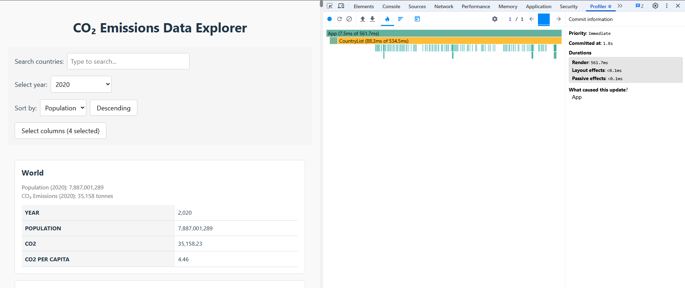
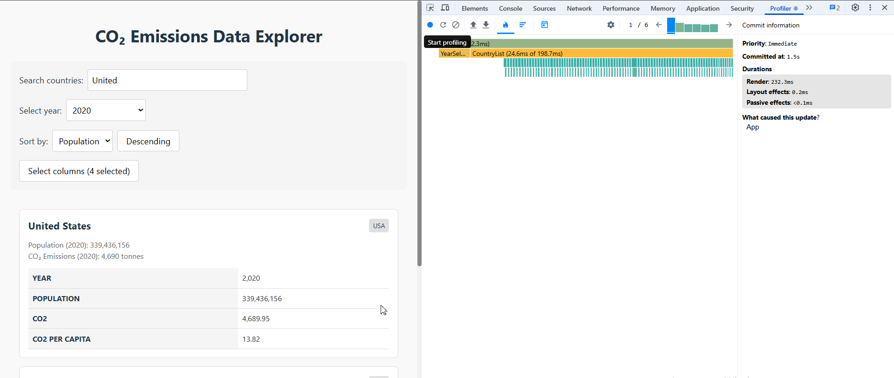
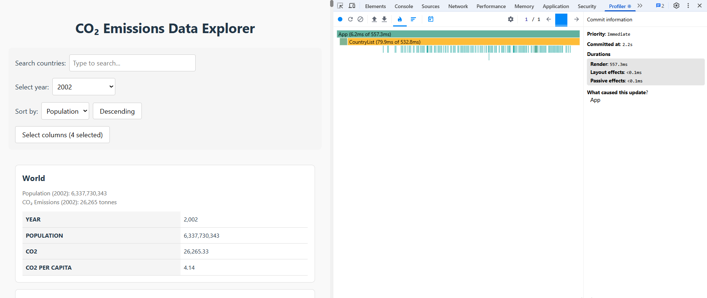
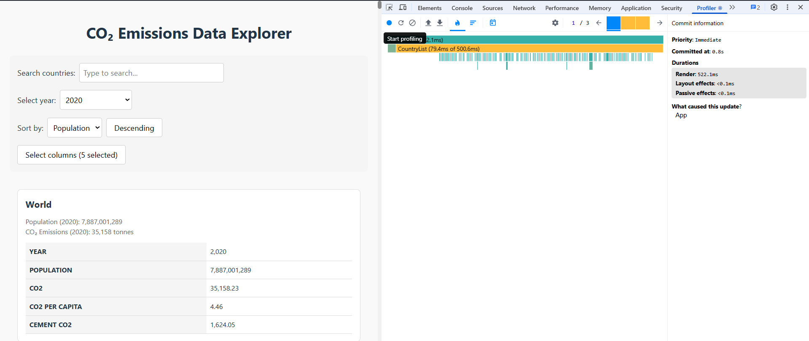
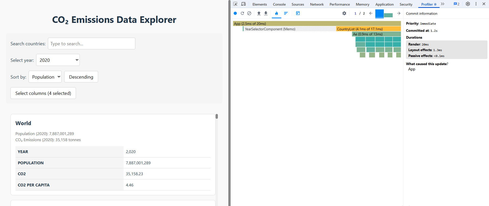
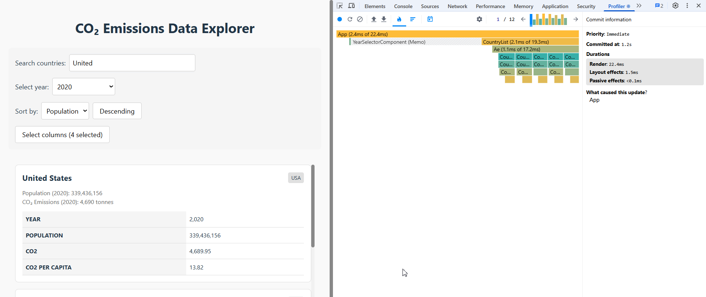
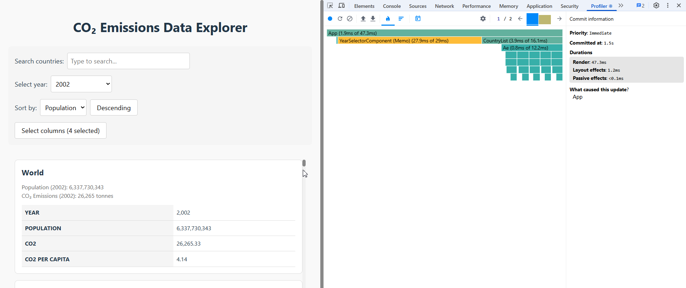
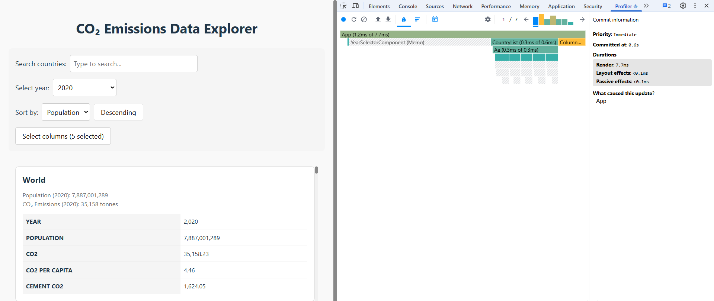

# Performance Optimization Report

## Baseline Measurements

### Interaction A: Sort countries

- **Commit duration**: Not recorded (not required)
- **Render duration**: 561.7 ms
- **Screenshot**: 

### Interaction B: Search countries

- **Commit duration**: Not recorded (not required)
- **Render duration**: 232.3 ms
- **Screenshot**: 

### Interaction C: Change year

- **Commit duration**: Not recorded (not required)
- **Render duration**: 557.3 ms
- **Screenshot**: 

### Interaction D: Toggle column

- **Commit duration**: Not recorded (not required)
- **Render duration**: 522.1 ms
- **Screenshot**: 

## Optimized Measurements

### Interaction A: Sort countries

- **Commit duration**: Not recorded (not required)
- **Render duration**: 20 ms
- **Screenshot**: 

### Interaction B: Search countries

- **Commit duration**: Not recorded (not required)
- **Render duration**: 22.4 ms
- **Screenshot**: 

### Interaction C: Change year

- **Commit duration**: Not recorded (not required)
- **Render duration**: 47.3 ms
- **Screenshot**: 

### Interaction D: Toggle column

- **Commit duration**: Not recorded (not required)
- **Render duration**: 7.7 ms
- **Screenshot**: 

## Summary of Improvements

| Interaction      | Baseline (ms) | Optimized (ms) | Improvement |
| ---------------- | ------------- | -------------- | ----------- |
| Sort countries   | 561.7         | 20             | 96.44%      |
| Search countries | 232.3         | 22.4           | 90.36%      |
| Change year      | 557.3         | 47.3           | 91.51%      |
| Toggle column    | 522.1         | 7.7            | 98.53%      |
| **Average**      | **468.35**    | **24.35**      | **94.80%**  |
